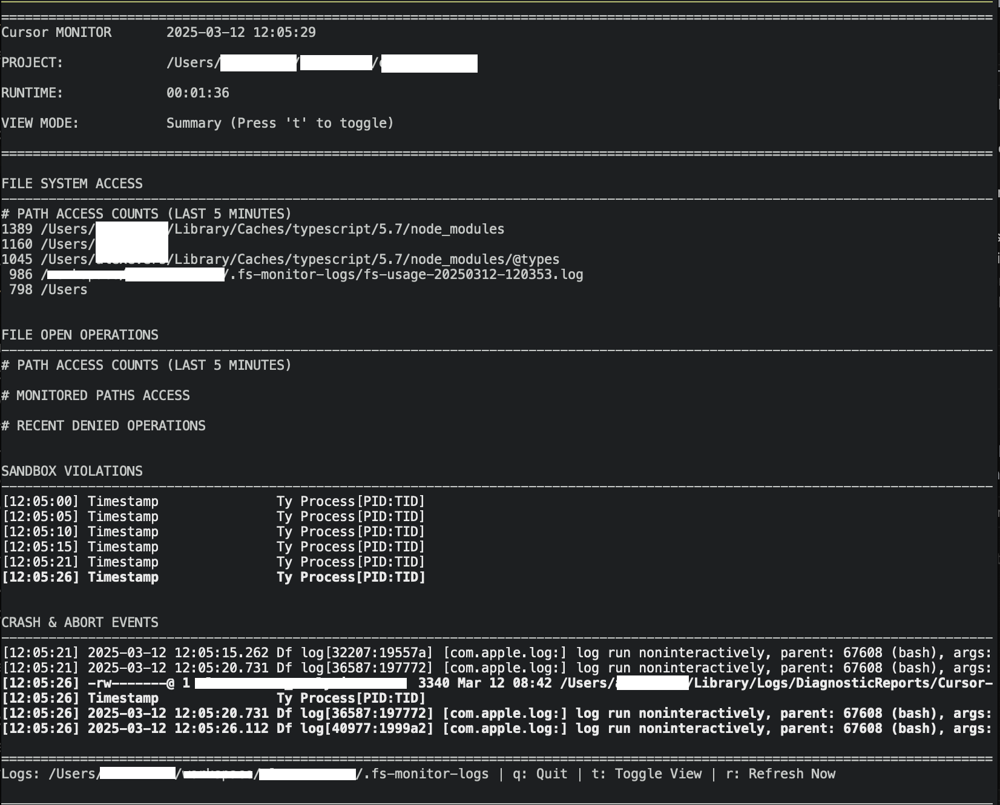

# FS Monitor

A real-time monitoring tool for tracking file system access and sandbox violations for applications on macOS. Currently configured to monitor the Cursor application by default.

## Overview

FS Monitor provides a terminal dashboard for monitoring how applications interact with the file system. It combines multiple monitoring methods into a single interactive interface, helping you understand which files are being accessed and detect when applications might be trying to access files outside their permitted areas.

## Features

- **Real-time file system operation monitoring** using `fs_usage`
- **File open event tracking** using `opensnoop`
- **Sandbox violation detection** using macOS unified logging
- **Crash and abort event monitoring**
- **Color-coded aging system** where newer events appear bright and fade to gray over time
- **Basic summary view** showing most frequently accessed paths
- **Configurable for any application** (e.g., Cursor, VS Code, or any other app)
- **Comprehensive logging** of all events for later analysis

## Example Screenshot



## Prerequisites

- macOS 10.12 (Sierra) or later
- Administrative privileges (requires sudo)
- DTrace tools installed (included in macOS by default)

## Installation

1. Download the script:
   ```bash
   curl -o fs-monitor.sh https://raw.githubusercontent.com/1ps0/fs-monitor/main/fs-monitor.sh
   ```

2. Make it executable:
   ```bash
   chmod +x fs-monitor.sh
   ```

## Usage

### Basic Usage

```bash
# Defaults to Cursor
sudo ./fs-monitor.sh /path/to/your/project
```

```bash
sudo ./fs-monitor.sh /path/to/your/project "Application Name"
```

Replace `/path/to/your/project` with the directory you want to monitor, and `"Application Name"` with the name of the application to track.

### Examples

Monitor Cursor in your current project:
```bash
sudo ./fs-monitor.sh $(pwd) "Cursor"
```

Monitor VS Code in a specific project:
```bash
sudo ./fs-monitor.sh /path/to/project "Visual Studio Code"
```

Monitor Safari browser activity:
```bash
sudo ./fs-monitor.sh $HOME "Safari"
```

### Interface

The interface is divided into four panels:

1. **FILE SYSTEM ACCESS** - File system operations with basic summary or raw logs
2. **FILE OPEN OPERATIONS** - File open events with basic summary or raw logs
3. **SANDBOX VIOLATIONS** - Detected sandbox restriction violations
4. **CRASH & ABORT EVENTS** - Application crashes and abort traps

### Controls

- Press `q` to quit the monitor
- Press `t` to toggle between summary and raw log views
- Press `r` to refresh the display immediately
- Press `Ctrl+C` to exit

### Logs

All monitoring data is saved to the `.fs-monitor-logs` directory within your project folder:

```
/path/to/project/.fs-monitor-logs/
├── fs-usage-[timestamp].log          # File system calls
├── opensnoop-[timestamp].log         # File open operations
├── sandbox-[timestamp].log           # Sandbox violations
└── crash-[timestamp].log             # Crash events
```

## Summary View

The current summary view provides basic information:

- Most frequently accessed paths
- Access counts for monitored paths
- Recent denied operations (if any)

## Known Issues and Limitations

### Privilege Requirements

- **Requires root access**: Both `fs_usage` and `opensnoop` require sudo privileges
- If not run with sudo, the script will exit with an error

### Performance Impact

- Running the monitor has a moderate performance impact on the system
- The script generates substantial log data during extended monitoring sessions

### Display Issues

- Very high activity can cause the display to flicker or become less responsive
- Terminal resizing during operation might temporarily disrupt the display

### Monitoring Limitations

- Electron apps like Cursor are complex and generate many file system events
- Some extremely short-lived file operations might be missed
- Some system events might be misattributed if multiple processes have the same name

## Troubleshooting

### No Activity Showing

If you don't see any activity in one or more panels:

1. Ensure the target application is running and actively being used
2. Check the log files directly to verify data is being collected
3. Try restarting the monitor

### High CPU Usage

If the monitor is using excessive CPU:

1. The application might be performing intensive operations generating many events
2. Consider increasing the refresh interval in the script (change `REFRESH_INTERVAL=2` to a higher value)

### Terminal Display Issues

If the terminal display looks corrupted after exiting:

1. Try running the `reset` command
2. Or reopen your terminal window

## Basic Configuration

You can modify these variables at the top of the script to customize behavior:

- `APP_NAME`: The application name to monitor (passed as second parameter)
- `PROJECT_PATH`: Path to monitor (passed as first parameter)
- `REFRESH_INTERVAL`: How often the display refreshes (in seconds)
- `SHOW_SUMMARY`: Whether to default to summary view (true) or raw logs view (false)
- `MONITORED_PATHS`: Basic array of paths to track in summaries

## Security Considerations

This tool reveals detailed information about file system operations. Be mindful when using it in sensitive environments or when sharing logs.

## License

This tool is provided as open source under the MIT License.

## Credits

Created to help developers understand and control application file system access patterns.
